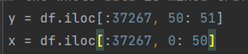
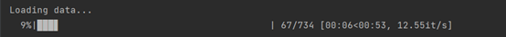

## **Introduction**

**To know details about the details, please refer to my report.**

This project focuses on dealing with data collected from MAC layer and PHY layer (mainly the PHY layer) during the transmission, to do traffic classification. The aim of this project is to analyze the features of data in PHY layer, and to test different kinds of classification algorithms based on the data.

In this part, we did experiments on Amarisoft to simulate 3 types of traffic (web browsing, audio streaming and video streaming). We ran HTTP traffic to simulate web browsing, VoIP to simulate audio streaming and RTP to simulate video streaming. After simulation of 3h HTTP, 3h RTP and 2.5 VoIP, we captured the DCI (downlink control information) transferred in PDCCH in the PHY layer, since it is unencrypted and in clear text. After testing, we found that in single traffic situation, Gaussian Bayes model based on TBS solo is good enough for 99% classification. But in mixed traffic situation, the designed RNN-CNN shows better performance, with 2 features TBS + IAT.

## **Repository Structure**

#### **Data**

Raw data from DCIs, Directory of NPZ data files and CSV data files, as well as the dataloader. 

#### **ML_methods**

Implementation of classical ML algorithms, containing Gaussian Bayes model, KNN model and Random Forest model.

#### **model**

Model Structure of designed CNN, RNN and RNN+CNN, realized in pytorch.

#### **main.py**

The testing code of NNs models, change inside to choose a specific type of model to do the classification and then make modification of hyper-parameters inside, like the learning rate and the batch size. The console will present the learning process and outcome of the data.

## **Get Start**

> #### **For ML algorithms:**

1)  Choose the database for experiments. The database stored in Data directory, which could be applied here are /final_data_test.csv, /final_data_test_6.csv and /final_data_test_6\_tuan.csv. All the
    data is saved as CSV file. Check inside the CSV file to identify the input format and output format of data. 

2. Turn to ML methods directory. Choose the models above and change the data source path.

   
   

3)  Change the inside input and label for experiments.

> ​	In final_data_test_6\_tuan.csv, the first 37267 rows are single traffic situation.
> 
>

4)  Run the model and the console will show the testing results. It takes 1 -- 10 s.

> 
> 
>
> 
>#### **For NN algorithms:**

1)  Make connection with GPU if possible. Otherwise, change the device in main.py to "cpu"
    
2)  Choose the database for experiments and change the data path in dataloader. Look in details about the directories in /Data described above. Choose the most suitable one, and identify the input format and output format.

> 

3)  Back to main.py and select among the models below: CNN, RNN, RNN-CNN

> Change the hyperparameters to make the model more suitable to the data. To change the  structure of the model, please refer to model directory to make modification.
> 
> 

4)  Initiate appropriate optimizer and learning rate for the model.

> 

5)  Run main.py, then the model will start to train and then show outcomes after tests. The training and testing time will be reduced if using GPU. (To know how to make connection with GPU in INFRE
    telecom Paris, please search online how to make SSH connection).
    Then the result will show as below.

> Train:
> 
> 
>
> Test:
>
> 
> 
>Result:
> 
>

