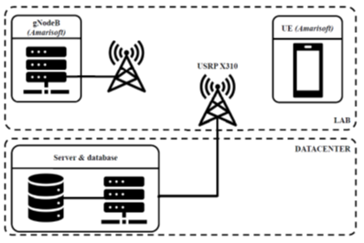
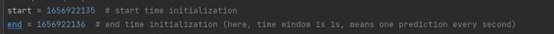

##  **Introduction**

**To know details about the details, please refer to my report.**

**

The whole process in the TICK stack is as follow. The detailed data in PHY and MAC LAYER is collected during mobile transmission by network telemetric technologies (Telegraph). The data is stored in the influx DB part and shown in the Chronograph, which has been done before. 

This project focuses on extracting the data stored in influx DB by some existing python APIs and analyzing the data with some tested models. Some of the data extracted is stored in CSV file (or .npz file) for model training. The left data, which is supposed to be the real-time data detected, is preprocessed and then put into the trained model. The python console will show the classification outcome of our algorithms. Finally, to make the classification outcome more visible, the last part is to write back the classification results and present them on chronograph.

 

## **File description**

**mac_extraction.py**

Extracting mac layer data (mainly l, with time) from the influx DB. Make connection with the influx DB and then query the data in a certain period of time (in the sample, it was 6 days in July). The data we extracted finally is 50 data points with one lcid number, which represents the service type. The data is stored into a CSV file for model training further. In our sample, the data is stored in data_mac_727.csv.

 

**phy_extraction.py**

Extracting phy layer data (mainly Qm, R, Nrb, T) from the influx DB, the same as the process mentioned in mac_extraction.py. In real-time test, it is a bit difficult for us to label the data in phy layer (in mac layer, lcid is a good representation), so only the code of extraction is done here. To make use of the phy layer data, it is worth considering that, how to label the data, and how to separate the data when they are mixed together and transferred.

 

**bayes.py**

A simple model from “algorithms” project is applied here to do classification, the process is quite easy. As is proved in algorithm parts, the bayes model turns to be the best-suited in single traffic classification.

 

**test.py**

Doing real-time test. Start from a certain time stamp (in the case, 2022-07-04 16:08:55), and the extract data every 1 seconds. Then data extracted is preprocessed to fit in the prediction model and then applied into it. The classification result will be shown in the console window, with the timestamp.

 

**model/gaussianNB.model**

The model preferred in single traffic situation, trained with the data in CSV file.

 

**3.**   **Usage of the code**

1. Change the parameters in mac_extrarciton.py, query the data from influx DB and store them into csv file (if you want to take use of the CNN models, store them into .npz file). The data will be used for model training, so the more the better.

2.  Then, change the csv file path (data source) in bayes.py, train the gaussian model and then store the model into GaussianNV.model. 

3.  Turn to test.py, change the initialization of start-point and end-point, set the time-window each measurement.

4.  Run the classification based on the model trained. Then the console will continuously output classification results.

 

## **Jobs remain to be done**

1.  Write back the data to influx DB.

The classification results are achieved from the API part, in the Pycharm console. It is preferred to write back the results to the influx DB, and present it on the Chronograph. However, the author is not the owner of the database: only query operations are allowed, more permission is required to change the data in the database. This could not be an easy job, for a new hand knowing nothing about influx DB, it will take time to download and learn how to do CRUD (Create, Read, Update, Delete) operations.

2.  Make use of the PHY data.

In the MAC layer, only l is accessible, which means only one feature could be captured to do the classification. In the PHY layer, Qm, R and Nrb are available, possibly bringing more information if we use reasonable ML methods. However, data in PHY layer is not labeled. For ex, if we use lcid=5 to transfer RTP and lcid=6 to transfer HTTP at the same time, all the data is mixed together in PHY channel. The tough job here would be labeling the PHY data.